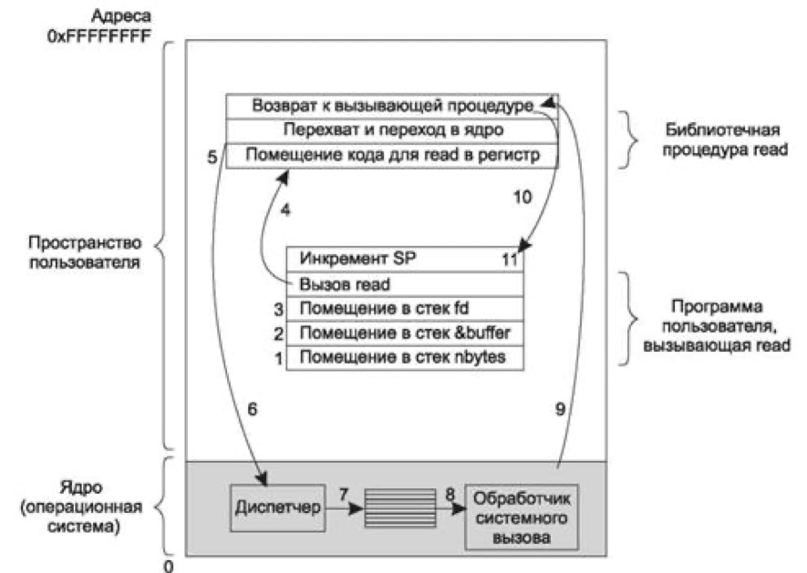

# Системные вызовы

Систе́мный вы́зов (англ. system call) в программировании и вычислительной технике — обращение прикладной программы к ядру операционной системы для выполнения какой-либо операции.

В некотором смысле выполнение системного вызова похоже на выполнение особой разновидности вызова процедуры, с той лишь разницей, что системные вызовы входят в ядро, а процедурные — нет.

Для того чтобы прояснить механизм системных вызовов, рассмотрим системный вызов чтения — `read`. Как уже упоминалось, он имеет три параметра: первый служит для задания файла, второй указывает на буфер, а третий задает количество байтов, которое нужно прочитать. Как практически все системные вызовы, он осуществляется из программы на языке `C` с помощью вызова библиотечной процедуры, имя которой совпадает с именем системного вызова: `read`. Вызов из программы на C может иметь следующий вид: 
`count = read(fd, buffer, nbytes);`

Выполнение системного вызова состоит из нескольких шагов. Сначала, при подготовке вызова библиотечной процедуры `read`, которая фактически и осуществляет системный вызов `read`, вызывающая программа помещает параметры в стек.

Компиляторы C и C++ помещают параметры в стек в обратном порядке, следуя исторически сложившейся традиции (чтобы на вершине стека оказался первый параметр функции `printf` — строка формата вывода данных). Первый и третий параметры передаются по значению, а второй параметр передается по ссылке, поскольку это адрес буфера (о чем свидетельствует знак `&`), а не его содержимое. Затем осуществляется фактический вызов библиотечной процедуры (шаг 4). Эта команда представляет собой обычную команду вызова процедуры и используется для вызова любых процедур. 

Библиотечная процедура, возможно, написанная на ассемблере, обычно помещает номер системного вызова туда, где его ожидает операционная система, например в регистр (шаг 5).

Затем она выполняет команду TRAP для переключения из пользовательского режима в режим ядра, и выполнение продолжается с фиксированного адреса, находящегося внутри ядра операционной системы (шаг 6).
Фактически команда TRAP очень похожа на команду вызова процедуры в том смысле, что следующая за ней команда берется из удаленного места, а адрес возврата сохраняется в стеке для последующего использования.

Начавшая работу после команды TRAP часть ядра (диспетчер на рис. 1. 17) проверяет номер системного вызова, а затем передает управление нужному обработчику. Обычно передача управления осуществляется посредством таблицы указателей на обработчики системных вызовов, которая индексирована по номерам этих вызовов (шаг 7).

После этого вступает в действие обработчик конкретного системного вызова (шаг 8).

Как только обработчик закончит работу, управление может быть возвращено библиотечной процедуре, находящейся в пользовательской области памяти, той самой команде, которая следует за командой TRAP (шаг 9).

В свою очередь эта процедура вернет управление пользовательской программе по обычной схеме возврата из процедуры (шаг 10).

Чтобы завершить работу с процедурой `read`, пользовательская программа должна очистить стек, точно так же, как она это делает после любого вызова процедуры (шаг 11).

Если в нашем примере стек растет вниз (как это чаще всего и бывает), пользовательская программа в скомпилированном виде должна содержать команды увеличения указателя стека ровно настолько, чтобы были удалены параметры, помещенные в стек перед вызовом процедуры `read`.

Теперь программа может продолжить свою работу. 



```
Вызов Описание 

Управление процессом 
pid = fork() 	Создает дочерний процесс, идентичный родительскому 
pid = waitpid(pid, &statloc, options) 	Ожидает завершения дочернего процесса 
s = execve(name, argv, environp) 	Заменяет образ памяти процесса 
exit(status) 	Завершает выполнение процесса и возвращает статус 
Управление файлами 
fd = open(file, how...) 	Открывает файл для чтения, записи или для того и дру- гого 
s = close(fd) 	Закрывает открытый файл 
n = read(fd, buffer, nbytes) 	Читает данные из файла в буфер 
n = write(fd, buffer, nbytes) 	Записывает данные из буфера в файл 
position = lseek(fd, offset, whence) 	Перемещает указатель файла 
s = stat(name, &buf) 	Получает информацию о состоянии файла 
Управление каталогами и файловой системой 
s = mkdir(name, mode) 	Создает новый каталог 
s = rmdir(name) 	Удаляет пустой каталог 
s = link(name1, name2) 	Создает новый элемент с именем name2, указывающий на name1 
s = unlink(name) 	Удаляет элемент каталога 
s = mount(special, name, flag) 	Подключает файловую систему 
s = umount(special) 	Отключает файловую систему 
Разные 
s = chdir(dirname) 	Изменяет рабочий каталог 
s = chmod(name, mode) 	Изменяет биты защиты файла 
s = kill(pid, signal) 	Посылает сигнал процессу 
seconds = time(&seconds) 	Получает время, прошедшее с 1 января 1970 года
```